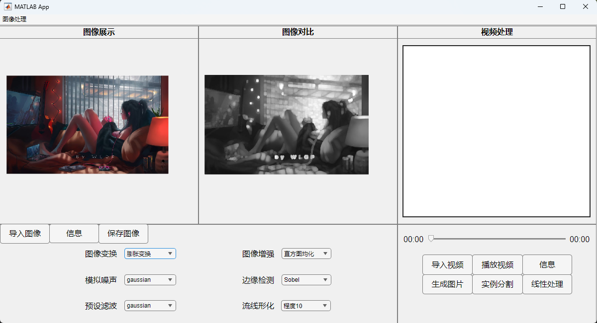
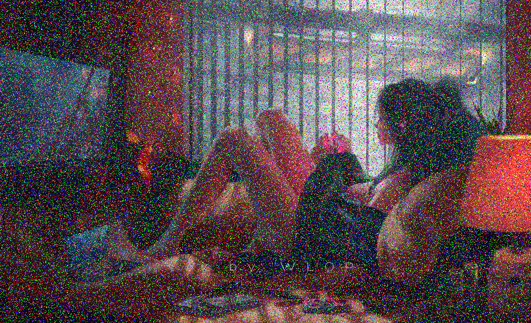
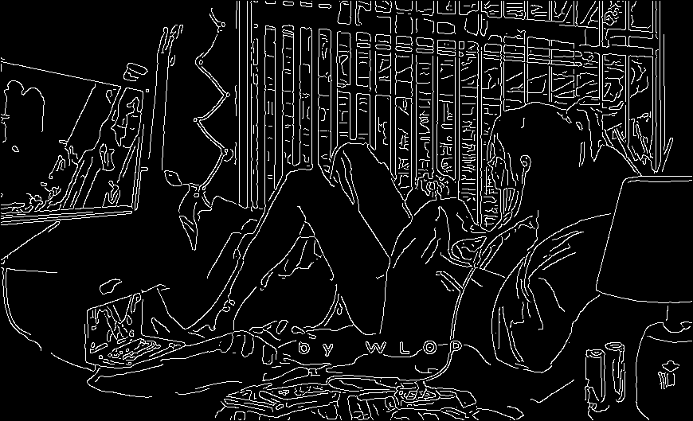
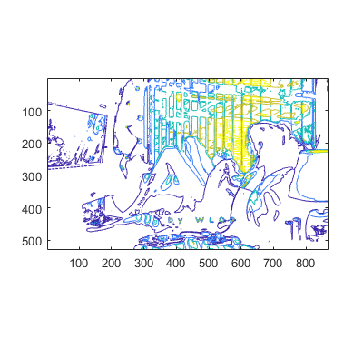

# Multifunctional-image-and-video-processing-system
Intended to allow users to experience the unique effects of images and videos after a series of transformations, encouraging more students to understand image processing technology; at the same time, this software can also be used for batch processing of a large number of images and videos.warning：This software relies on the Matlab environment and requires you to install the software into the Matlab APP.

# 1.Related functions
  ### 图片处理功能
| 功能 | 描述 |
|------|------|
| 导入图片、保存图片功能 | 支持导入和保存多种格式的图片（.jpg、.png、.bmp、.gif） |
| 图像变换功能 | 包括傅里叶变换、腐蚀变换、膨胀变换等 |
| 模拟噪声功能 | 人为给输入的图片添加噪声，支持多种噪声类型（gaussian、localvar、poisson、salt&pepper、speckle） |
| 预设滤波功能 | 选择不同的滤波器对图片进行滤波处理 |
| 图像增强功能 | 包括直方图均化、对比度调整、对数变换、卷积滤波、线性滤波、中值滤波、锐化处理等 |
| 边缘检测功能 | 使用 edge() 函数，支持多种边缘检测方法（Sobel、Prewitt、Roberts、log、zerocross、Canny、approxcanny） |
| 流线形化功能 | 利用 imcontour() 函数对图片进行处理，支持不同程度的提取 |

  ### 视频处理功能
| 功能 | 描述 |
|------|------|
| 导入视频功能 | 支持导入多种格式的视频（.mp4、.m4v、.mj2、.mpg、.wmv、.avi） |
| 播放视频功能 | 自动播放导入的视频，支持重新播放 |
| 生成图片功能 | 将视频的每一帧图片提取并保存到指定文件夹 |
| 实例分割功能 | 对视频的每一帧图片进行实例分割处理，并生成新的视频 |
| 线性处理功能 | 对视频的每一帧图片进行边缘检测处理，并生成新的视频 |
| 视频进度显示功能 | 在视频展示下方设置进度条，显示实时播放时刻和总时长 |

# 2.Results
### 软件的执行界面显示

### 图像相关处理实例
|膨胀变换|椒盐噪声|对比调整|边缘检测|流线型化|
|----|----|----|----|----|
||||||

### 视频相关处理实例
<video width="320" height="240" controls>
  <source src="asserts/video_0.AVI" type="video/avi">
  Your browser does not support the video tag.
</video>

<video width="320" height="240" controls>
  <source src="asserts/video_1.AVI" type="video/avi">
  Your browser does not support the video tag.
</video>
